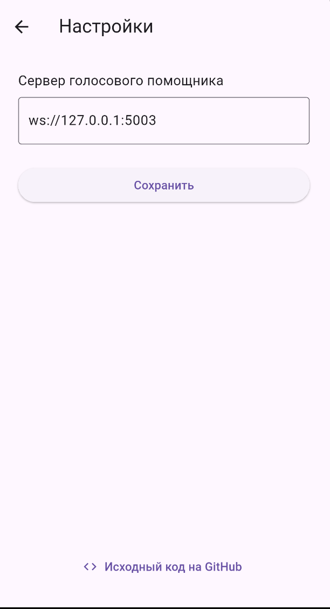

## Клиент для голосового ассистента Ирина

Кроссплатформенное приложение для взаимодействия с голосовым ассистентом Ирина.

Позволяет отправлять голосовые команды на сервер, получать ответы и воспроизводить их голосом.

---

## Скриншот

<p align="center">
  
  
  
</p>

---

## Поддерживаемые платформы

- Linux
- macOS Catalina 10.15+
- Windows 10+
- Android 6.0+
- iOS 12.0+

---

## Скачать приложение

Готовые сборки доступны на странице релизов:

[Открыть релизы на GitHub](https://github.com/magomedcoder/irene-assistant-client/releases)

---

## Как использовать

1. Установите и запустите сервер Ирины ([https://github.com/janvarev/Irene-Voice-Assistant](https://github.com/janvarev/Irene-Voice-Assistant)).
2. Убедитесь, что сервер доступен по WebSocket (`runva_webapi.py`).
3. Укажите адрес сервера в настройках клиента.
4. Нажмите кнопку микрофона и скажите, например:
   > _Ирина, привет_

> Если сервер из основного репозитория был изменён и стал несовместим с приложением, вы можете воспользоваться форком, который работает с текущей версией клиента:  
> [https://github.com/magomedcoder/Irene-Voice-Assistant](https://github.com/magomedcoder/Irene-Voice-Assistant)

---

## Сборка из исходников

**Минимально рекомендуемая версия Flutter: `3.22.0`**  
(совместима с Dart `3.4.0`)

```bash
git clone https://github.com/magomedcoder/irene-assistant-client.git
cd irene-assistant-client
flutter pub get
flutter build linux --release
flutter build macos --release
flutter build windows --release
flutter build apk --release
flutter build ios --release
```
